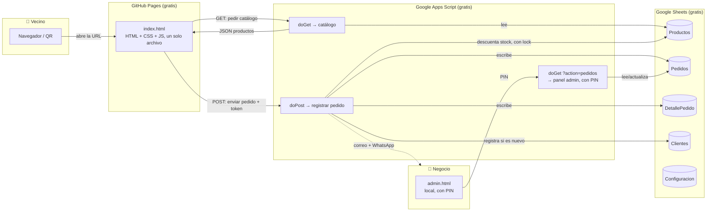

# Tu Despensa — Resumen del Proyecto

App de pedidos a domicilio para el conjunto residencial Mitika. Los vecinos piden por una página web sencilla; el negocio recibe y gestiona los pedidos directamente en una hoja de Google Sheets, con un panel de administración aparte protegido por PIN.

**Última actualización:** 2026-09-12

## Enlaces en vivo

| Qué | URL |
|---|---|
| **App (lo que ven los vecinos)** | https://oscarmao07.github.io/TuDespensa/ |
| **Backend / API** (uso interno, no se comparte) | `https://script.google.com/macros/s/AKfycbwWKRrTnQ-QN9GpqSzV0p3m6W50DybJjMMM7gnPGUGhhCAQNEo1Z4mOAR-A8DhZP5Hc/exec` |
| **Panel admin** (PIN configurado en Propiedades del script, no acá) | `admin.html` — hoy solo local en `D:\07_Proyectos\TuDespensa\admin.html`, no está publicado en ningún link (ver nota de seguridad abajo) |
| **Base de datos** (Google Sheet) | `Inventario_Despensa_Mitika` — ID `1qs-UZ8xNab9SUkzA_nYaTLgt1tOvhw69oJ949jMoiFg` |
| **Proyecto de Apps Script** | "Despensa" — ID `1bebZcb7d-HcNv7O5grbs08z6hOhL00nCO9wcpuvWAEitlCdrBfbU908m` |
| **QR para repartir** | `qr/QR_TuDespensa.png` (apunta a la URL de la app — no cambió) |

**Costo mensual: $0.** GitHub Pages es gratis para repos públicos; Google Sheets + Apps Script es gratis dentro de las cuotas normales de una cuenta personal. No hay servidor propio que pagar.

## ⚠️ Qué pasó el 12 de septiembre de 2026 (léelo antes de tocar el backend)

Este proyecto tuvo **dos backends de Apps Script en paralelo durante un tiempo**, sin que quedara claro cuál era el real:

- `src/apps-script/Codigo.js` ("v2") — el que de verdad estaba en producción, con protección por token compartido.
- `Code.gs` (raíz) ("v3") — una versión más completa hecha en otra sesión (panel admin, PIN, bloqueo de stock, etc.), **nunca evaluada ni desplegada**.

Al intentar arreglar unos hallazgos de seguridad en `Code.gs`, terminamos publicando esa versión **por accidente en el mismo proyecto de Apps Script que usa la app real**, y de paso una implementación vieja quedó archivada, tumbando el sitio en vivo por un rato. Se resolvió así:

1. Se fusionaron las dos versiones en una sola: **`Code.gs` (raíz) es ahora el único backend real**, con el token de `v2` restaurado + todas las mejoras de `v3` (PIN admin, bloqueo de stock, IDs únicos, confirmación de precio, notificación por correo Y WhatsApp).
2. `src/apps-script/Codigo.js` y `src/apps-script-frontend/` quedan **obsoletos** — no se usan, se dejan en el repo solo como referencia histórica.
3. Se creó una implementación nueva y limpia de Apps Script (la URL de la tabla de arriba) para no depender de las implementaciones viejas sin nombre ("Sin título") que causaron la confusión.

**Moraleja para la próxima vez:** este proyecto de Apps Script ("Despensa", ID de arriba) tiene *un solo* `Código.gs` que hay que mantener actualizado — no hay separado "de prueba" y "real". Si en algún momento vuelve a haber dos código fuente candidatos, pará y confirmá cuál es el que corre detrás de `https://oscarmao07.github.io/TuDespensa/` antes de publicar nada.

## Arquitectura — de un vistazo



**Tres piezas, tres proveedores gratuitos distintos:**
1. **Frontend** (lo visual, lo que el vecino toca) → GitHub Pages, archivo `index.html` en la raíz del repo (NO `github-pages/index.html` local — esa carpeta local es tu copia de trabajo antes de subirla, GitHub no la usa como subcarpeta).
2. **Backend** (la lógica: qué hay en stock, dónde guardar el pedido, quién es admin) → Google Apps Script, un "Web App" que expone `GET` (catálogo o pedidos si sos admin) y `POST` (pedido nuevo o cambio de estado).
3. **Base de datos** → Google Sheets, la misma hoja de cálculo que el negocio puede abrir y editar a mano en cualquier momento.

## Paso a paso: qué pasa cuando alguien hace un pedido

1. **El vecino escanea el QR o abre el link** → llega a `https://oscarmao07.github.io/TuDespensa/`.
2. **La página carga el catálogo** (`GET` a `doGet`) — solo productos con `Estado` = `activo` u `OK`.
3. **Arma su carrito** (en memoria del navegador) y hace checkout.
4. **Confirma → `submitOrder()`.** Envía por `POST`: token compartido, datos del cliente, ítems, y el `total` que calculó con los precios que tenía cargados.
5. **El backend valida, en orden:**
   - Token correcto (si no, rechaza sin escribir nada).
   - Campos obligatorios presentes.
   - Agrupa cantidades por producto (si el mismo producto aparece en varias líneas del carrito) y valida stock **una sola vez por producto**, contra el stock real de la hoja — nunca confía en precios/stock que mande el navegador.
   - Si el precio recalculado del lado del servidor difiere del `total` que mandó el cliente (cambió el precio en la hoja mientras tanto), **no completa el pedido en silencio** — devuelve `status:'price-changed'` con el total real; el frontend le muestra un `confirm()` al vecino y solo si acepta reenvía con `confirmarNuevoPrecio:true`.
   - Genera (o valida que no choque) un `orderId` único — nunca confía ciegamente en el que propone el navegador.
6. **Si todo pasa, escribe en la hoja** (bajo un `LockService` para que dos compras simultáneas del mismo producto no se pisen): fila en `Pedidos`, filas en `DetallePedido`, descuenta `stock` en `Productos` (con `SpreadsheetApp.flush()` antes de soltar el lock, para que la próxima compra concurrente vea el stock ya actualizado), y registra el cliente si es nuevo.
7. **Notifica** (best-effort, nunca rompe el pedido si falla): correo a `omcarvajalx@gmail.com` y, si está configurado el API key de CallMeBot, WhatsApp.
8. **Responde `{status:'ok', orderId, total}`.** El frontend muestra el `orderId` que confirma el servidor (no el que él mismo propuso) — si hubo un choque de IDs, este es el que de verdad quedó guardado.
9. **Botón de WhatsApp** en la pantalla de éxito, con mensaje pre-escrito para que el vecino notifique directo — manual, no automatizado.
10. **El negocio gestiona el pedido** desde `admin.html` (PIN) o directo en la hoja `Pedidos`.

## Panel de administración (`admin.html`)

- Pide un **PIN** (configurado en Propiedades del script del proyecto de Apps Script, no en el código — así no viaja con el código fuente).
- Tras **10 intentos fallidos**, se bloquea todo intento por 5 minutos (protección básica contra fuerza bruta; el bloqueo es global, no por atacante, porque Apps Script no expone la IP de quien llama).
- Permite ver todos los pedidos y cambiar su estado (Recibido → Preparando → Entregado / Cancelado).
- **Cancelar un pedido devuelve el stock reservado** a `Productos`. **Reabrir un pedido cancelado** (cambiarlo a otro estado) lo vuelve a descontar.
- Todos los valores del pedido se escapan antes de insertarse en el HTML (protección contra XSS — un cliente no puede inyectar código metiendo HTML en su nombre u observación).
- Hoy `admin.html` es **solo un archivo local**, sin publicar (se abre con doble clic o `Live Server`). No está enlazado desde `index.html` a propósito. Si en el futuro querés acceder desde el celular sin estar en tu compu, hay que decidir dónde publicarlo (¿otra página de GitHub Pages, sin enlazar? ¿Netlify aparte?) — pendiente.

## Estructura de la hoja de cálculo

| Hoja | Para qué sirve |
|---|---|
| `Productos` | Catálogo: nombre, categoría, presentación, precio compra/venta, stock, margen, **Estado** (`activo` u `OK` = visible en la app) |
| `Pedidos` | Un renglón por pedido: cliente, torre, apto, WhatsApp, estado, método de pago, total |
| `DetallePedido` | Un renglón por producto dentro de cada pedido |
| `Clientes` | Se llena solo, automáticamente, la primera vez que compra cada WhatsApp |
| `Configuracion` | Parámetros de referencia (pedido mínimo, horarios) — hoy están *hardcodeados* en el HTML, no se leen dinámicamente todavía (aunque el backend ya sabe leerla si se conecta) |

## Estructura de archivos del proyecto (local)

```
D:\07_Proyectos\TuDespensa\
├── README.md                        ← este archivo
├── Code.gs                          ← BACKEND REAL — se pega en el editor de Apps Script
├── admin.html                       ← panel admin real, local (ver sección de arriba)
├── DEPLOY.md                        ← guía paso a paso de despliegue
├── index.html (raíz)                ← ⚠️ NO es el que está en vivo — copia de trabajo desactualizada,
│                                        no recibió los últimos fixes (precio/ID). Usar github-pages/index.html.
├── github-pages/index.html          ← copia local de LO QUE ESTÁ EN VIVO en GitHub Pages
│                                        (en GitHub mismo vive como `index.html` en la raíz del repo,
│                                        no dentro de una carpeta — subilo ahí, no acá)
├── qr/QR_TuDespensa.png             ← QR actual, apunta a GitHub Pages (no cambió)
├── src/apps-script/Codigo.js        ← ⚠️ OBSOLETO — backend viejo (v2), ya no se usa, ver nota de arriba
├── src/apps-script-frontend/        ← ⚠️ OBSOLETO — intento abandonado de alojar el HTML en Apps Script
├── src/TuDespensa_MVP.html          ← copia de trabajo antigua, no confirmado si sigue vigente
├── notas/                           ← notas tuyas de ajustes pendientes
├── docs/superpowers/                ← spec y plan de rondas de rediseño anteriores
└── .git/                            ← historial local (sin remoto conectado a GitHub todavía —
                                         subir archivos se hace a mano por la web de GitHub por ahora)
```

## Cómo hacer cambios (para las próximas mejoras)

**Cambiar el frontend** (diseño, textos, imágenes de producto, promociones visuales, o cualquier ajuste de precio/checkout):
1. Edita `github-pages/index.html` (local).
2. Súbelo a GitHub: en `github.com/Oscarmao07/TuDespensa`, abrí `index.html` (el de la raíz del repo) → ✏️ Edit → pegá el contenido → Commit changes. GitHub Pages se actualiza solo en ~1-2 minutos.

**Cambiar el backend** (nueva lógica, nuevos campos, nuevas hojas):
1. Edita `Code.gs` (raíz — este, no `src/apps-script/Codigo.js` que está obsoleto).
2. Pega el contenido completo en el editor de Apps Script del proyecto **"Despensa"** (ID de la tabla de arriba — asegurate de estar en el proyecto correcto, no en el que se abre por defecto desde "Extensiones → Apps Script" de la hoja, que puede ser uno distinto).
3. Guardá.
4. **Importante:** guardar no republica la URL en vivo. Hay que ir a **Implementar → Gestionar implementaciones → ✏️ (en la implementación con la URL de la tabla de arriba) → Nueva versión → Implementar** cada vez.

**Cambiar datos** (precios, stock, productos nuevos, promociones puntuales): directo en la hoja `Productos` de Google Sheets — no requiere tocar código. El campo `Estado` controla si un producto se muestra o no.

## Seguridad (para tener en cuenta)

- **Token compartido** (`SHARED_TOKEN` en `Code.gs`) entre el frontend y el backend: evita pedidos automatizados de quien no vio el código de la app. No es autenticación real (cualquiera que abra el código fuente de la página puede verlo), pero mantiene la misma protección que ya existía.
- **PIN del panel admin**: vive en Propiedades del script (no en el código fuente ni en este README, a propósito — nunca lo pegues acá ni en ningún archivo que se suba a GitHub). Bloqueo tras 10 intentos fallidos.
- **XSS corregido** en `admin.html`: los datos de pedidos (nombre, observación, etc.) se escapan antes de insertarse en el HTML.
- **Precio recalculado del lado del servidor**, nunca se confía en lo que manda el navegador; si cambió desde que el cliente cargó el catálogo, se le pide confirmar el nuevo precio en vez de aceptar en silencio.
- **IDs de pedido únicos**: el servidor no confía ciegamente en el `orderId` que propone el cliente — si choca con uno existente, genera otro y lo devuelve en la respuesta.
- ⚠️ **Pendiente de limpiar:** `CALLMEBOT_PHONE` (el número de WhatsApp para notificaciones) está como texto plano en `Code.gs` — si este archivo llega a subirse a un repo público, ese número quedaría expuesto. Antes de publicar `Code.gs` en algún lado público, valdría la pena moverlo a Propiedades del script igual que se hizo con el PIN.
- No hay pasarela de pago real: los métodos (Nequi, Daviplata, Transferencia, Efectivo) son solo declarativos — se confirma el pago manualmente por WhatsApp.
- No hay backups automáticos del Google Sheet — actívalos manualmente (Archivo → Historial de versiones, o copias periódicas) si vas a depender de esto en serio.

## Pendientes / ideas para más adelante

- Conseguir el API key real de CallMeBot para que la notificación por WhatsApp funcione (hoy solo llega el correo) — ver `DEPLOY.md` sección 2.
- Decidir dónde publicar `admin.html` para poder gestionar pedidos desde el celular, no solo desde la compu que tiene el archivo local.
- Mover `CALLMEBOT_PHONE` a Propiedades del script (ver nota de seguridad arriba).
- Limpiar las implementaciones de Apps Script viejas ("Sin título") que quedaron sin usar, para no repetir la confusión del 12 de septiembre.
- Conectar el repo local (`D:\07_Proyectos\TuDespensa`) a GitHub con `git remote add`, para poder subir cambios con `git push` en vez de copiar y pegar a mano por la web.
- Config dinámica: la hoja `Configuracion` existe y el backend ya sabe leerla, pero el frontend todavía no la consume — el pedido mínimo y horarios siguen fijos en el HTML.
- Imágenes reales de producto, promociones, y alinear el flyer (`CatalogoProductos.png`) con el catálogo real — ideas mencionadas, no implementadas.
